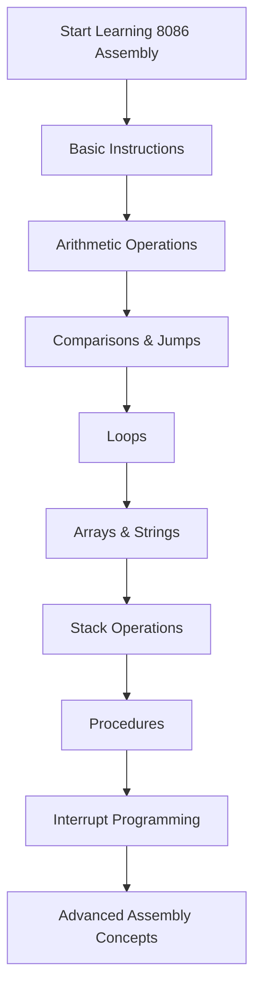

<div align="center">

# 🖥️ Learn 8086 Microprocessor Assembly Language


A beginner-friendly repository designed to help anyone **learn 8086 Assembly programming from scratch through clear explanations and practical examples**.

</div>

---

# 📑 Table of Contents

* Overview
* Project Objective
* Tools Used
* Core Concepts
* How It Works — Step-by-step
* Workflow
* Key Concepts
* What I Learned
* Through this project I also gained insight into
* Project Structure
* How to Run the Project
* Future Improvements
* Author
* License

---

# 📘 Overview

The **8086 Microprocessor** is one of the most important processors in the history of computer architecture. Learning 8086 Assembly language helps programmers understand how computers work at the **lowest level**.

Assembly programming is widely used in:

* Embedded Systems
* Operating Systems
* Computer Architecture Learning
* Hardware Programming
* Performance-Critical Software

This repository was created to provide a **clear and structured path for beginners to learn 8086 Assembly programming**.

Instead of focusing only on theory, this repository emphasizes:

• **Practical Assembly programs**
• **Step-by-step learning**
• **Understanding microprocessor architecture**

By following this repository, beginners can gradually move from **basic instructions to advanced low-level programming concepts**.

---

# 🎯 Project Objective

The goals of this repository are:

• Help beginners **learn 8086 Assembly from zero**
• Provide **simple explanations of microprocessor concepts**
• Demonstrate assembly instructions with **clear code examples**
• Build a **strong foundation in low-level programming**
• Encourage **practice through real assembly programs**

---

# 🛠 Tools Used

The following tools are used in this project.

### MASM / TASM Assembler

Assemblers used to convert assembly code into machine code.

### DOSBox Emulator

Used to simulate a DOS environment where 8086 programs can run.

### Git & GitHub

Used for version control and sharing the repository publicly.

---


# ⚙️ How It Works — Step-by-step

The learning process in this repository follows a structured progression.

1. Start with **basic assembly syntax and data movement instructions**
2. Learn **arithmetic operations like ADD and SUB**
3. Understand **comparisons and conditional jumps**
4. Work with **loops and decision-making logic**
5. Explore **arrays and string handling**
6. Learn **stack operations and procedures**
7. Understand **interrupts and system services**
8. Study **advanced assembly techniques**

Each step builds on previous knowledge to strengthen understanding.

---

# 🔄 Workflow



This workflow represents a **progressive learning roadmap for mastering 8086 Assembly programming**.

---

# 📚 Core Concepts

### Registers

Important CPU registers used in assembly programming:

* `AX` – Accumulator
* `BX` – Base register
* `CX` – Counter register
* `DX` – Data register
* `SI` – Source Index
* `DI` – Destination Index
* `BP` – Base Pointer
* `SP` – Stack Pointer

### Memory Addressing

Different ways to access memory:

* Direct Addressing
* Indirect Addressing
* Indexed Addressing
* Based Addressing

### Assembly Instructions

Common instructions used in programs:

* `MOV`
* `ADD`
* `SUB`
* `MUL`
* `DIV`
* `CMP`
* `JMP`

### Data Directives

Define and reserve memory:

* `DB` – Define Byte
* `DW` – Define Word
* `DD` – Define Double Word
* `RESB` – Reserve Bytes

---


# 🧠 Key Concepts

| Concept             | Description                    |
| ------------------- | ------------------------------ |
| 🧮 Registers        | AX, BX, CX, DX, SI, DI, BP, SP |
| ⚙️ Instructions     | MOV, ADD, SUB, MUL, DIV        |
| 🔀 Control Flow     | CMP, JMP, JE, JA, JNE          |
| 🧠 Flags            | ZF, CF, SF, OF                 |
| 📦 Addressing Modes | Direct, Indirect, Indexed      |
| 📚 Stack            | PUSH, POP, CALL, RET           |
| 🧵 Strings          | MOVSB, STOSB, SCASB, CMPSB     |

---

# 📦 Data Structures in Assembly

### Arrays

```
DB 1,2,3,4
```

Byte arrays for storing sequences of numbers.

### Strings

```
DB 'Hello$',0
```

Null-terminated strings used in DOS programs.

### Tables

```
DW 10,20,30
```

Word tables useful for lookup operations.

### Buffers

```
RESB 100
```

Reserved memory blocks for temporary data.

---

# 🚀 Advanced Concepts

### Procedures

Reusable code blocks using:

```
PROC
ENDP
```

### Macros

Code templates using:

```
%macro
```

### Interrupts

System services using:

```
INT 21h
```

### String Instructions

Efficient string operations:

* `MOVSB`
* `STOSB`
* `SCASB`
* `CMPSB`

### Far Calls

Used for calling procedures across memory segments.

---

# 🎓 What I Learned

While building this repository, I gained experience in:

• Writing **clean assembly programs**
• Understanding **low-level computer architecture**
• Structuring a **learning roadmap for assembly language**
• Using GitHub to document **technical programming knowledge**
• Explaining complex microprocessor concepts **in simple language**

---

# 💡 Through this project I also gained insight into

• How microprocessors execute instructions
• The importance of **memory management and registers**
• How early computers handled **input/output operations**
• Structuring educational repositories for **hardware-level programming**
• Explaining low-level programming concepts clearly

---

## 📁 Project Structure

The repository maintains a flat structure, with each assembly program stored as an individual `.asm` file directly in the root directory. The files are numerically prefixed to suggest a potential learning progression, though they can be explored in any order.

```
learn8086MicroprocessorAssemalyLanguage/
├── 01_Single_Character.asm
├── 02_Name_Separate_Characters.asm
├── ...
├── 45_Take_Input_And_Multiply_Using_Procedure.asm
├── LICENSE
└── README.md
```

## 📚 Programs List

This is a detailed list of all assembly programs available in this repository:

| S.No. | File Name| Description                                                                                     |
| 1.    | `01_Single_Character.asm`                      | Prints a single character to the console.                                                       |

| 2.    | `02_Name_Separate_Characters.asm`              | Prints a name by displaying each character separately.                                          |

| 3.    | `03_Print_Registration_Number.asm`             | Displays a predefined registration number.                                                      |

| 4.    | `04_Single_Character_Input.asm`                | Takes a single character input from the user and displays it.                                   |

| 5.    | `05_Subtracting_Two_Numbers.asm`               | Performs subtraction of two predefined numbers.                                                 |

| 6.    | `06_Adding_Two_Numbers.asm`                    | Performs addition of two predefined numbers.                                                    |

| 7.    | `07_Get_Input_Add_Them.asm`                    | Takes two single-digit numbers as input, adds them, and displays the result.                    |

| 8.    | `07_Get_Input_Add_Them0.asm`                   | (Duplicate/alternative for 07) Takes two numbers as input, adds them, and displays the result.  |

| 9.    | `08_Convert_Capital_to_Small_Letter.asm`       | Takes a capital letter as input and converts it to its corresponding small letter.              |

| 10.   | `09_Add_Sub_Single_Program.asm`                | A single program demonstrating both addition and subtraction operations.                        |

| 11.   | `10_Input_Multiple_Char_and_Print_it.asm`      | Takes multiple characters (a string) as input and prints it back.                               |

| 12.   | `11_Using_Var_Datatypes_Offset.asm`            | Demonstrates the use of variables, data types (DB, DW, DD), and memory offsets.                 |

| 13.   | `12_Print_Two_Strings_In_Different_Lines.asm`  | Prints two predefined strings, each on a new line.                                              |

| 14.   | `13_Program_Using_DB_DW_DD.asm`                | (Empty) Intended to demonstrate DB, DW, DD data types.                                          |

| 15.   | `14_Loop_0_to_9_Ascending_Order.asm`           | Prints numbers from 0 to 9 in ascending order using a loop.                                     |

| 16.   | `15_Compare_Two_Using_CMP.asm`                 | Compares two numbers using the `CMP` instruction and shows conditional logic.                   |

| 17.   | `16_Loop_9_to_0_Descending_Order.asm`          | Prints numbers from 9 to 0 in descending order using a loop.                                    |

| 18.   | `17_Print_Test_5_Times_Loop.asm`               | Prints the string "Test" five times using a loop.                                               |

| 19.   | `18_Simple_Array.asm`                          | Demonstrates defining and accessing elements of a simple array.                                 |

| 20.   | `19_Print_Array_Loop.asm`                      | Prints all elements of an array using a loop.                                                   |

| 21.   | `20_Print_Array_Value_on_Specific_Index.asm`   | Prints the value of an array element at a specific index.                                       |

| 22.   | `21_Using_Two_DIfferent_Arrays_and_Print.asm`  | Works with two different arrays, possibly performing operations or printing them.                 |

| 23.   | `22_Print_String_Using_Loops.asm`              | Prints a predefined string character by character using a loop.                                 |

| 24.   | `23_Print_A_to_Z_In_Capital_And_Small.asm`     | Prints the alphabet from A to Z (both capital and small letters).                               |

| 25.   | `24_Store_String_Find_Length.asm`              | Stores a string and then calculates and displays its length.                                    |

| 26.   | `25_Get_Integer_Display_It_Is_Even_Odd.asm`    | Takes an integer input and determines if it is even or odd.                                     |

| 27.   | `26_Take_Input_Print_Name.asm`                 | Takes a name as input from the user and prints it.                                              |

| 28.   | `27_Find_Largest_In_Array.asm`                 | Finds and displays the largest number in a given array.                                         |

| 29.   | `28_Input_And_Add_Them.asm`                    | Takes two numbers as input and displays their sum.                                              |

| 30.   | `29_Swaping_Using_Stack.asm`                   | Demonstrates swapping the values of two variables using the stack.                              |

| 31.   | `30_Reverse_Using_Stack.asm`                   | Reverses a sequence of data using stack operations.                                             |

| 32.   | `31_Smallest_Number_Array.asm`                 | Finds and displays the smallest number in a given array.                                        |

| 33.   | `32_Input_Two_Subtract_Them.asm`               | Takes two numbers as input and displays their difference.                                       |

| 34.   | `33_Reverse_Input_String.asm`                  | Takes a string as input and displays its reversed version.                                      |

| 35.   | `34_Reverse_Numeric_Values.asm`                | Takes a sequence of numeric values as input and displays them in reverse order.                 |

| 36.   | `35_Jump_Condition.asm`                        | Illustrates various conditional jump instructions (`JE`, `JNE`, `JL`, `JG`, etc.).              |

| 37.   | `36_Print_The_Pattern.asm`                     | Prints a simple character pattern.                                                              |

| 38.   | `37_Print_Pattern_01.asm`                      | Prints a specific pattern (e.g., triangle of stars/numbers).                                    |

| 39.   | `38_Print_Pattern_02.asm`                      | Prints another specific character/numeric pattern.                                              |

| 40.   | `39_Print_Pattern_03.asm`                      | Prints a third distinct character/numeric pattern.                                              |

| 41.   | `40_Add_Using_Procedure.asm`                   | Implements an addition operation using a reusable `PROCEDURE`.                                  |

| 42.   | `41_Subtract_Using_Procedure.asm`              | Implements a subtraction operation using a reusable `PROCEDURE`.                                |

| 43.   | `42_Three_Strings_Using_Macros_Procedure.asm`  | Demonstrates printing three strings using both macros and procedures for modularity.            |

| 44.   | `43_Take_Strings_Input_Using_Macros_Procedure.asm` | Takes multiple strings as input, utilizing macros and procedures for I/O handling.              |

| 45.   | `44_Take_Input_And_Divide_Using_Procedure.asm` | Takes two numbers as input and performs division, implemented using a `PROCEDURE`.              |

| 46.   | `45_Take_Input_And_Multiply_Using_Procedure.asm` | Takes two numbers as input and performs multiplication, implemented using a `PROCEDURE`.        |


---
# ▶️ How to Run the Project

### Step 1 — Install DOSBox

Download DOSBox from: https://www.dosbox.com

### Step 2 — Install MASM or TASM

Install an assembler such as **MASM** or **TASM**

### Step 3 — Create an Assembly File

```
program.asm
```

### Step 4 — Assemble the Program

```
MASM program.asm
```

### Step 5 — Link the Program

```
LINK program.obj
```

### Step 6 — Run the Program

```
program.exe
```

inside **DOSBox**.

---

# 🚀 Future Improvements

Possible improvements for this repository:

• Add **more assembly practice programs**
• Include **step-by-step microprocessor diagrams**
• Add **8086 mini projects**
• Provide **debugging examples**
• Expand into **modern assembly architectures**

---

-   🐛 Issues: [GitHub Issues](https://github.com/ft-FiasCode/learn8086MicroprocessorAssemalyLanguage/issues)


<div align="center">

# 📜 License

[](https://opensource.org/licenses/MIT)

This project is open-source and free to use, modify, and distribute.

---

⭐ If you found this project useful, consider **starring the repository**!


Made with ❤️ by [ft-FiasCode](https://github.com/ft-FiasCode)

</div>

